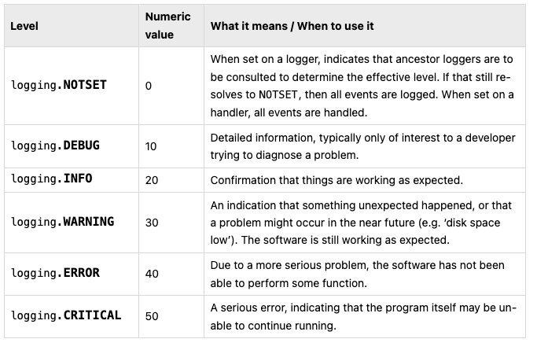

# About the Project

This is an Application to analyse, compare documents, upload one or more documents and chat with agent about the chat.

Modules:

1. Document Analyser
2. Document Compare
3. Chat module with single document
4. Chat module with multiple documents.

In the first two modules, the data is parsed from the document (PDF) and passed to LLM. Inputs along with prompts is passed to LLM, the output is validated using pydentic.
I have used PyMupdf/Fitz, it creates raw text and it was passed to LLM for summary/analysis, comparison.

Chat modules are implemented using RAG. For conversational module, cant pass raw text to LLM to get answers. So Embeddings has to be created.

Logging: With every execution a session folder is created using uuid, It is used for versioning.

# Commands Used:

## Virtual Environment:

To create a virtual env: 
conda create -n document_portal python=3.11
conda activate document_portal

To delete virtual env: 
conda remove --name document_portal --all

To create a env folder for the virtual environment: 
​​conda create -p env python=3.11
conda activate ./env
conda activate /Users/aishwaryagopalakrishnan/document_portal/env

Create env: python3 -m venv env
Activate: source env/bin/activate

## To open vs code from terminal

cd path

code .

## Installing Requirements of the project
To install all packages
pip install -r requirements.txt

## setup.py 

setup.py is a module used to build and distribute Python packages. It typically contains information about the package, such as its name, version, and dependencies, as well as instructions for building and installing the package. This information is used by the pip tool, which is a package manager for Python that allows users to install and manage Python packages from the command line. By running the setup.py file with the pip tool, you can build and distribute your Python package so that others can use it. 
The folders that contain __init__.py will be considered inside the package.

Command to install this document_portal as package into virtual environment. If you run pip list, document_portal will be there as a package with Editable project location as (/Users/user_name/document_portal)

pip install -e. 

## Git
Add a .gitignore file
to initialise it: git init
Anything inside .gitignore will not be visible on git

to uncommit: git reset --soft HEAD~1    

## Experiments.ipynb
used to testing.
choose kernel -> choose python interpreter

if it gives error use: pip install ipykernel

## Requirement.txt
As the project progresses, it is manually updated and everything inside it is installed.
pip install -r requirements.txt

provide the versions of each packages.

## .env file
create .env file and add the following:
Add the groq api key
Add google gemini key

GROQ_API_KEY="YOUR_GROQ_API_KEY"
GOOGLE_API_KEY="YOUR_GOOGLE_API_KEY"

# Logging and Exception:

Logging can be done using 
1. Custom log file - txt, pdf, doc files. 
2. Python built in module - struct log, logging etc.

Logging Levels: The numeric values of logging levels are given in the following table. These are primarily of interest if you want to define your own levels, and need them to have specific values relative to the predefined levels. If you define a level with the same numeric value, it overwrites the predefined value; the predefined name is lost.

Handlers are responsible for sending log messages to specific destinations. For instance, a FileHandler directs logs to a file, a StreamHandler sends them to the console (stdout/stderr), and other handlers might send them to network locations, databases, or other services.

# Config yml file:
A central repository to store config. So that we dont have to make changes in each file. It can be changed in this config file.

## Data versioning - using session folder

Data versioning in MLOps (Machine Learning Operations) is the practice of systematically tracking, managing, and storing different versions of datasets used throughout the machine learning lifecycle. It is crucial for ensuring reproducibility, traceability, and efficient collaboration in ML projects. Tools: 

### DVC (Data Version Control):
An open-source tool that integrates with Git to version large datasets and machine learning models. It stores data metadata in Git and the actual data in external storage (e.g., cloud storage, local file system), enabling efficient versioning of large files.
### LakeFS:
An open-source platform that provides Git-like version control for data lakes, allowing for branching, merging, and committing data changes in object storage.
### Pachyderm:
A platform for building version-controlled, automated data pipelines, offering data versioning as part of its end-to-end data management capabilities.
### Feature Stores:
While primarily for feature management, feature stores often incorporate versioning mechanisms for features, ensuring consistency across different models and deployments.

In this project, If a pdf comes every day, the pdf is embedded into vector db. Next day a new one comes, and data execution is run then today's file + yesterday's file will again be embedded in the db, causing data redundancy. Then the previous data is deleted (stored in archive) but no changes to embeddings. This is data versioning wrt every execution

## To so fast api testing: 

uvicorn is a ASGI server; asynchronous server gateway interface

/Users/user_name/document_portal/env/bin/python -m uvicorn main:app --reload  

It is done to consume the backend code (src) through the RESTFUL API using FastAPI. API is created to serve the application over the internet and deploy it, make it public. Initially it runs over the local host.

The client (browser), where the application runs, sends a GET request to the server (backend) for the HTML file (UI, e.g., index.html). The server processes the request and sends back the HTML in the HTTP response. The browser then renders the page for the user.

   ┌──────────────┐                  ┌────────────────────┐
   │   Client      │                  │      Server        │
   │ (Browser)     │                  │  (Backend code)    │
   └──────┬────────┘                  └─────────┬──────────┘
          │                                     │
          │  1. GET /index.html                 │
          ├────────────────────────────────────>│
          │                                     │
          │                   2. Respond with   │
          │        HTML (index.html) + assets   │
          │<────────────────────────────────────┤
          │                                     │
   3. Render HTML + assets to display UI        │
          │                                     │

In GET: client will request for something
POST: filling something in the UI and getting something from the server
